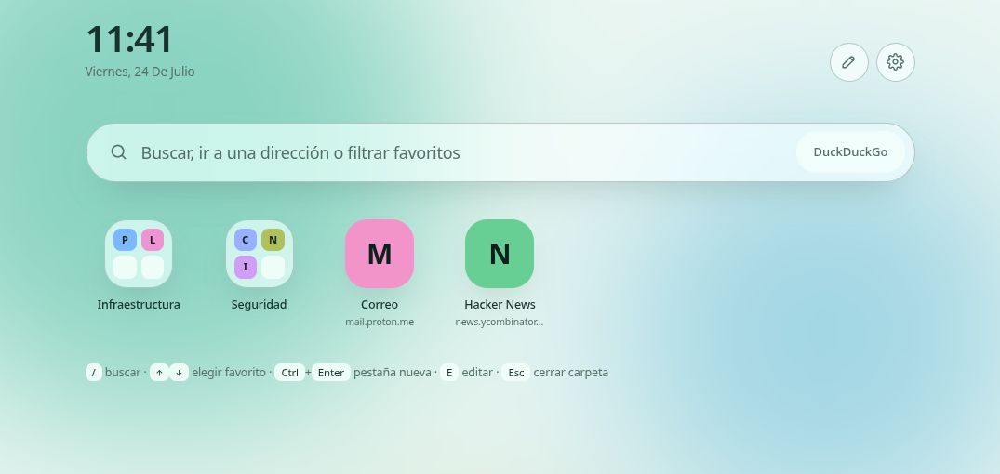
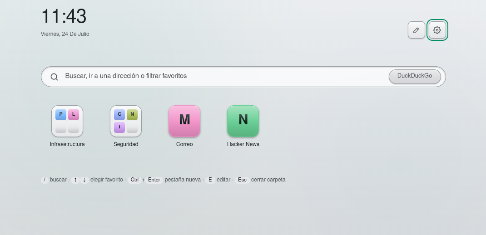
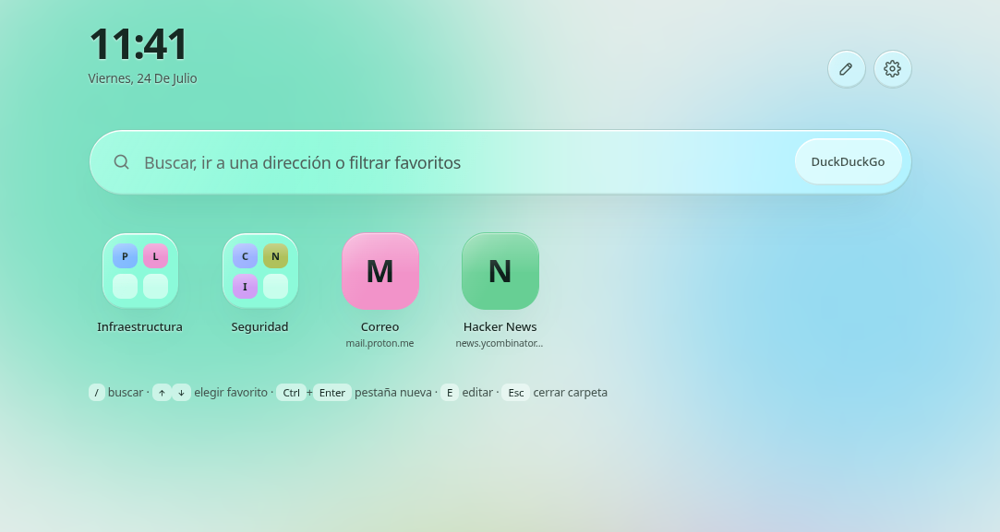
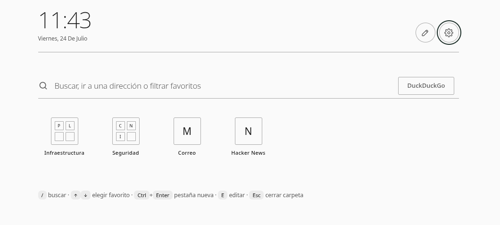
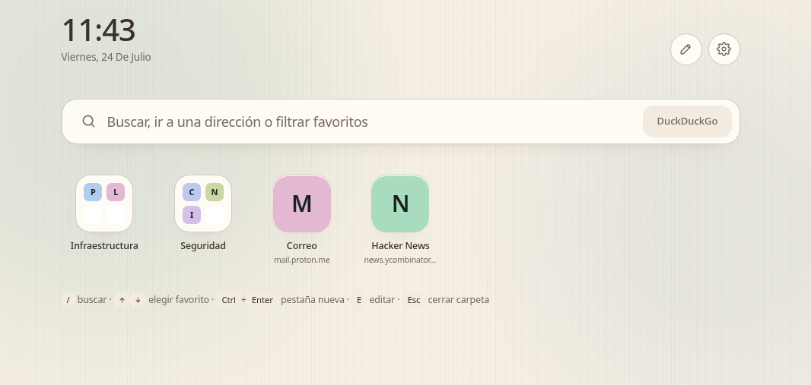
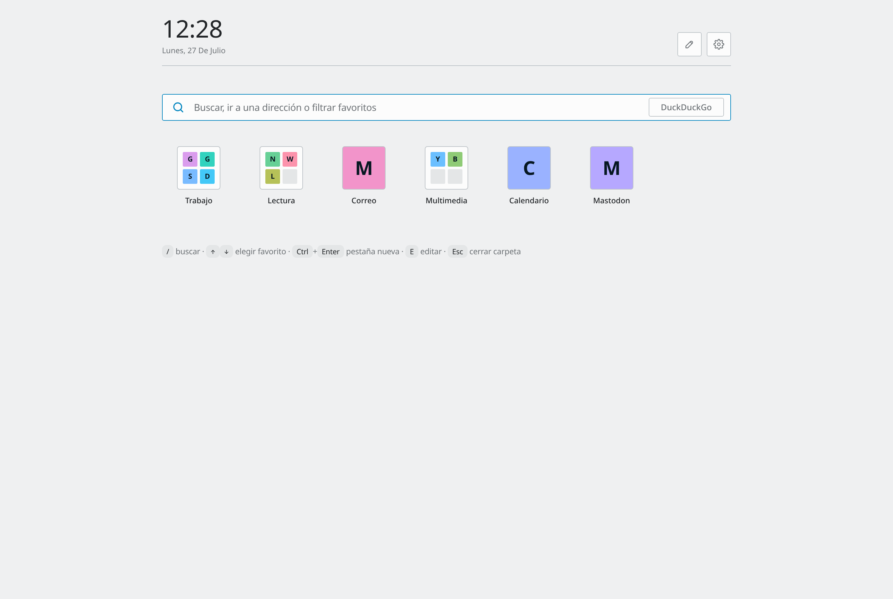

<div align="center">

# Zaguán

**Your start page, in a single file.**

A new tab page for Chromium-based browsers: search, Android-launcher-style bookmark folders
and six visual styles. One HTML file — no dependencies, no build step, and not a single
request to a third-party server.

[](LICENSE)


**English** · [Español](README.es.md)

[**Live demo →**](https://charlyrr.github.io/zaguan/?demo=1)

</div>

<br>

<div align="center">
  
</div>

<br>

---

## Styles

Six looks, each with its own light and dark variant.

|  |  |
|:---:|:---:|
| <br>**Vivid** — Material You | <br>**Classic** — old-school Mac OS X |
| <br>**Glass** — deep frosted glass | <br>**Minimal** — monochrome, hairline |
| <br>**Nordic** — linen and wood | <br>**Breeze** — KDE Plasma |

<table>
<tr><th align="left">Style</th><th align="left">Idea</th><th align="left">Traits</th></tr>
<tr><td><b>Vivid</b></td><td>Material You</td><td>Saturated background blobs, soft shapes, 24 px radii</td></tr>
<tr><td><b>Classic</b></td><td>Old-school Mac OS X</td><td>Blue-grey chrome, bevels, Aqua-style glossy icons, inset search field</td></tr>
<tr><td><b>Glass</b></td><td>Deep frosted glass</td><td>10 % opaque surfaces, 58 px blur, diagonal sheen, chromatic edges</td></tr>
<tr><td><b>Minimal</b></td><td>Monochrome</td><td>Outline icons, no shadows, search reduced to a single rule</td></tr>
<tr><td><b>Nordic</b></td><td>Linen and wood</td><td>Warm base, subtle grain, muted pastel icons</td></tr>
<tr><td><b>Breeze</b></td><td>KDE Plasma</td><td>Flat surfaces, 1 px frames, official Breeze palette, Plasma-blue selection</td></tr>
</table>

The accent colour is generated from a single seed hue you pick, so every style stays
readable whichever colour you choose. Breeze looks factory-fresh at hue **236**, which
lands on Plasma Blue.

---

## Features

**Search**
DuckDuckGo, Brave, Startpage, Wikipedia, Google, or your own template — handy if you
self-host a SearXNG instance. Type `proxmox.local:8006` or `localhost:8080` and it
navigates instead of searching.

**Live bookmark filter**
As you type, matching bookmarks appear with the folder they live in. Arrows to pick,
Enter to open.

**Launcher-style folders**
A compact icon with a 2×2 preview that expands into a panel via *container transform* —
the animation grows out of the icon you tapped.

**Loose shortcuts**
Single bookmarks living side by side with folders in the same grid.

**Drag and drop**
Reorder, drop links into folders, or pull them back out. Built on pointer events, so it
works with a finger on touch screens too.

**Backups**
An in-browser history with an automatic daily snapshot, plus JSON export and import.

**Own favicon**
Generated on the fly and recoloured with your chosen hue.

---

## Languages

The interface follows your browser's language automatically:

Español · English · Français · Deutsch · Italiano · Português · Русский · 中文

Anything else falls back to English. You can pin one in *Settings → Language*, or with
`?lang=fr`.

<details>
<summary><b>Adding a language</b></summary>

<br>

Translations live in the `I18N` object at the top of the `<script>`. Copy the `en` block,
translate the values and use the ISO code as the key:

```js
"nl": {
  _name: "Nederlands",   // as shown in the picker
  _locale: "nl",         // for dates and times
  appTitle: "Start",
  searchPlaceholder: "Zoeken, een adres invoeren of bladwijzers filteren",
  ...
}
```

74 keys in total. Leave the braced variables (`{name}`, `{n}`, `{folders}`, `{links}`,
`{date}`) untouched — they're substituted at runtime. Translation pull requests are very
welcome.

</details>

---

## Shortcuts

| Key | Action |
|---|---|
| `/` or any letter | Focus the search field |
| `↑` `↓` | Move through filtered bookmarks |
| `Enter` | Open or search |
| `Ctrl` + `Enter` | Open in a new tab |
| `E` | Edit mode |
| `Esc` | Close folder, or clear the search |

---

## Install

### From the web

Open the [live demo](https://charlyrr.github.io/zaguan/) and use it as is, or clone the
repo and publish it on your own GitHub Pages. Serving over HTTPS guarantees browser
storage works without surprises.

### As a local file

```bash
mkdir -p ~/.local/share/zaguan
curl -o ~/.local/share/zaguan/index.html \
  https://raw.githubusercontent.com/charlyrr/zaguan/main/index.html
```

Chromium treats every local file as an opaque origin and sometimes blocks storage. The
page detects this and warns you. If it happens, serve it locally:

```bash
cd ~/.local/share/zaguan && python3 -m http.server 8088 --bind 127.0.0.1
```

<details>
<summary><b>Setting it as your new tab page</b></summary>

<br>

**Helium** — open `helium://flags/#custom-ntp`, set it to *Enabled* and enter your page's
URL. Restart. Then in `helium://settings/onStartup`, tick *Open the New Tab page*.

**Chrome, Brave, Edge and other Chromium browsers without that flag** — they don't allow
changing the new tab page without an extension. You can set it as your startup page under
Settings → On startup, or use any *custom new tab* extension.

**Firefox** — works as a home page, but the new tab page needs an extension.

</details>

---

## URL parameters

Useful for linking a specific configuration or automating screenshots:

| Parameter | Values | Effect |
|---|---|---|
| `demo` | `1` | Loads sample bookmarks and **writes nothing** to the browser |
| `style` | `material`, `clasico`, `cristal`, `minimo`, `nordico`, `breeze` | Forces a style |
| `mode` | `auto`, `light`, `dark` | Forces light or dark |
| `lang` | `en`, `es`, `fr`, `de`, `it`, `pt`, `ru`, `zh` | Forces a language |
| `hue` | `0`–`359` | Forces the seed hue |

Example: `index.html?demo=1&style=cristal&mode=dark&hue=258`

---

## Privacy

- **No network requests.** No CDN, no web fonts, no analytics, no telemetry.
- **Favicons are off by default.** Icons are initials coloured from the domain name. If you
  turn them on, they're fetched from each site itself — never from Google's favicon
  service, which would leak your bookmark list.
- **Your data stays in your browser's `localStorage`** and never leaves your machine.

---

## Technical notes

- Plain HTML, CSS and JavaScript. No dependencies, no build step.
- Needs Chromium 111 or later for `oklch()` and `backdrop-filter`. Older browsers still
  work, but colours render flat.
- Colour is generated in OKLCH so all five styles keep their contrast as the hue changes.
  The favicon uses `hsl()` because it renders as a standalone image.
- Drag and drop uses pointer events rather than the HTML5 drag API: `<button>` doesn't
  fire `dragstart` reliably, `<a>` drags its own URL, and neither works on touch.
- Reordering animates with a FLIP transition; all animation respects
  `prefers-reduced-motion`.
- Versioned data structure with automatic migration from older formats.

<details>
<summary><b>Moving your data between origins</b></summary>

<br>

Storage is per origin, so switching from a local file to a URL starts you from scratch.
Before moving, go to *Settings → Backups → Download file*, then *Restore file* at the
destination.

</details>

---

## Contributing

Translations, styles and bug reports are all welcome. The whole project is a single
`index.html` — open it in an editor and you're set up.

## License

MIT. Do whatever you like with it.
